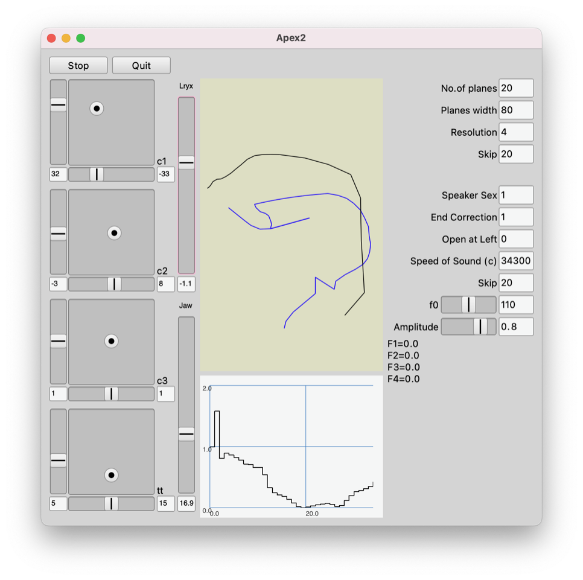

# Vocal Tract Modelling

> by Murphy, Shelley and Ternström - November 2015
>
> re-visited by Alex McLean

This repository is copied from <http://www-users.york.ac.uk/~dtm3/vocaltract.html> for the ease of installation.



## How to build

Because signing macOS binaries/libraries is a rather tedious task we can not provide them for you, therefore you need to build this by yourself.
For this you will need `cmake` and a source code copy of [SuperCollider](github.com/supercollider/supercollider) locally available.

After this create a `build` folder

```shell
mkdir build
cd build
```

and configure the build properly

```shell
cmake -DSC_PATH=<path_to_supercollider_source_code> ..
```

and build it via

```shell
cmake --build . --config Release --target install
```

After this copy the folder `KLVocalTract` which can be found in `build/install/src/klvocaltract/` to your extension directory which can be found by running `Platform.userExtensionDir.openOS` in SuperCollider.

The source code for the (optional) GUI is located in `src/apex_gui` and can be copied as well into the directory stated above. After this open `DAFx15.scd` and follow its content.

## A Guide to this directory

file | description
--- | ---
README.md | This file.
DAFx15.sc | A SuperCollider Script for testing and running APEX-SC and KLVocalTract including how to generate the examples used in the DAFx Paper
data | APEX data - the line to run APEX-SC in DAFx15.sc needs to point to this folder.
DAFx15_MurphyEtAl_FinalUpdated.pdf | The DAFx15 paper on which this work is based - updated from that available at http://www.ntnu.edu/web/dafx15/ to fix a few typos.
src | Source code to build the UGens.
src/apex_gui | Source code for the optional GUI - be aware: the GUI contains classes with very general names that are likely to clash with other extension libraries.

## Acknowledgements

The authors are indebted to Björn Lindblom and Christine Ericsdotter, both at Stockholm University, and to Johan Sundberg at KTH, for generously sharing their expertise and data, painstakingly acquired for the original APEX Windows 3.1 implementation, which was written by Johan Stark. The groundwork for the SuperCollider implementation of APEX was done in 2011 in the M.Sc. thesis of author Jani. The extended version presented here was developed in 2014- 2015 by authors Murphy and Ternström. We are grateful also to Gerhard Eckel and Ludvig Elblaus for advice and assistance with SuperCollider. The work was supported in part by the Swedish Research Council (VR), contract D-2013-0378.

## License

GPL-2.0
